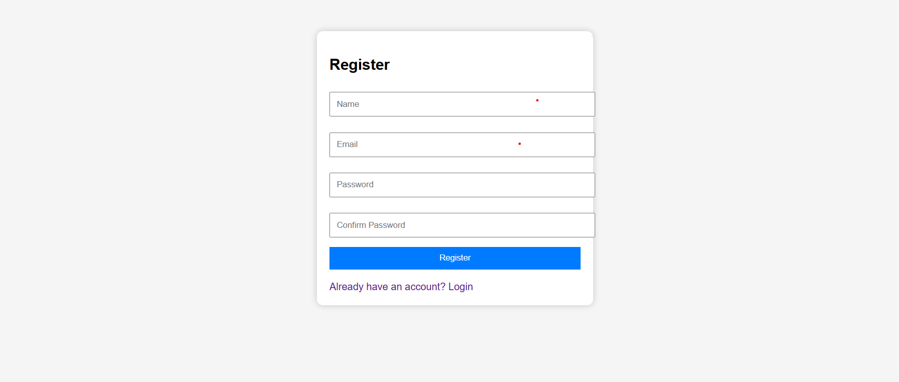
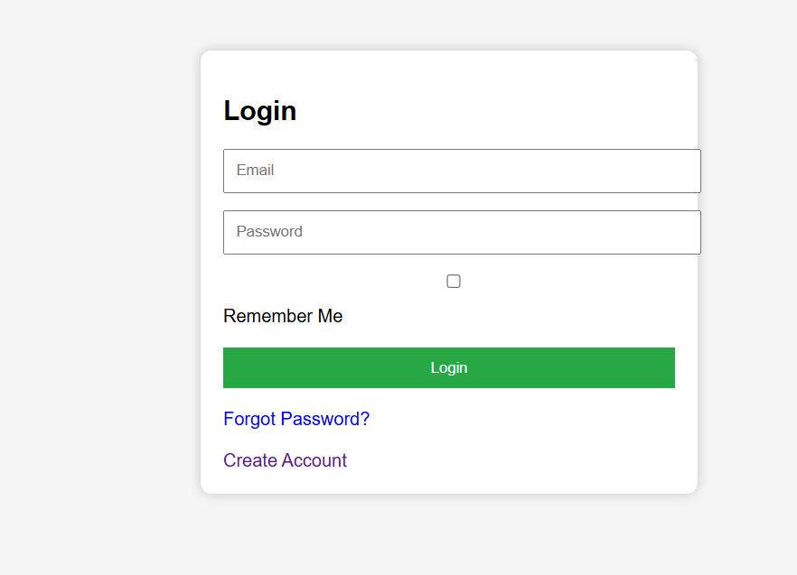
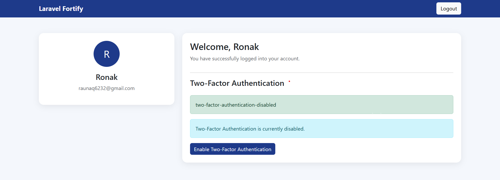
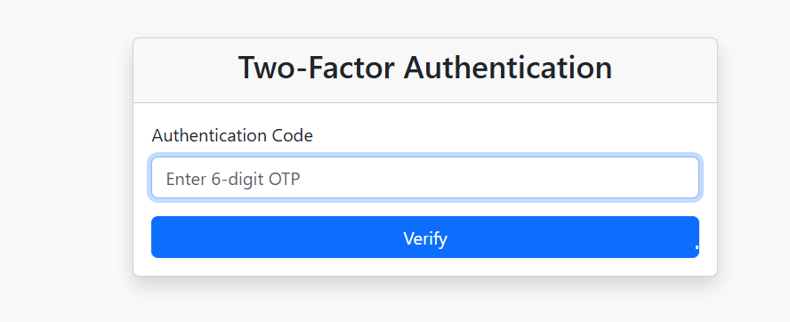
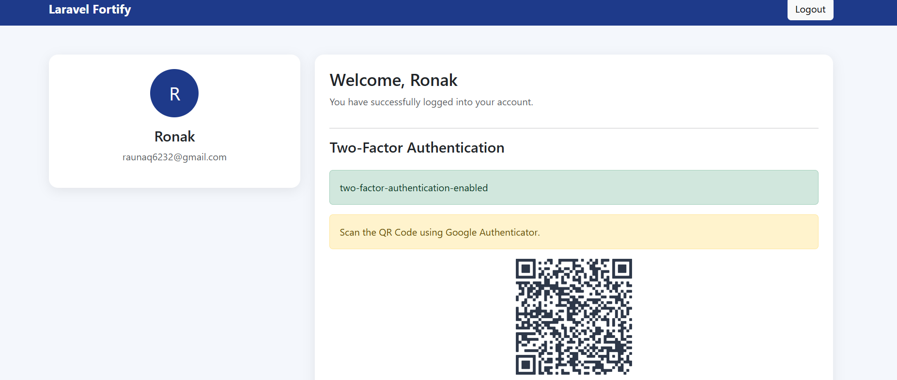
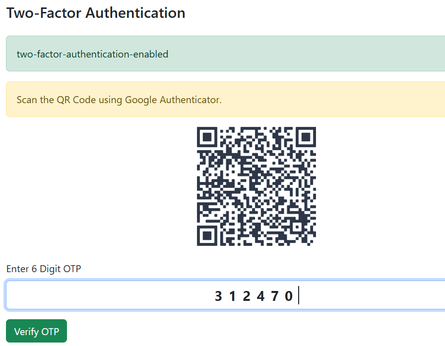
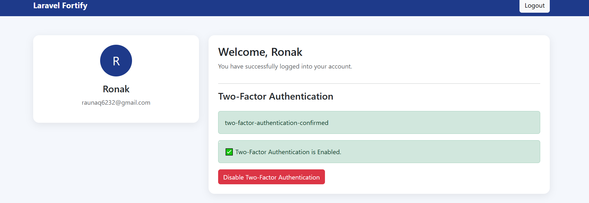

# Laravel Fortify Authentication System

A secure authentication system built with Laravel 12 and Laravel Fortify.

## Features

- User Registration
- User Login
- Logout
- Password Hashing
- Two-Factor Authentication (2FA)
- Google Authenticator Integration
- QR Code Generation
- OTP Verification
- Responsive Bootstrap Dashboard

## Technologies Used

- Laravel 12
- PHP 8.2
- MySQL
- Laravel Fortify
- Bootstrap 5
- Google Authenticator
- Bacon QR Code

## Screenshots

### Register Page



### Login Page



### Dashboard



### Two-Factor Authentication



### QR Code



### OTP Verification



### Enabled Two-Factor Authentication


## Installation

```bash
git clone https://github.com/ronakfiza/laravel-fortify-authentication-system.git

cd laravel-fortify-authentication-system

composer install

cp .env.example .env

php artisan key:generate

php artisan migrate

php artisan serve
```

## Author

**Ronak Fiza**

GitHub: https://github.com/ronakfiza
